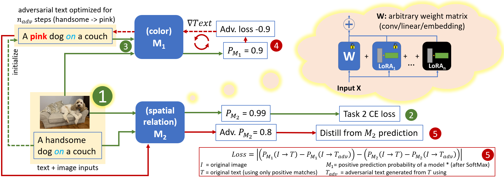

## ConStruct-VL: Data-Free Continual Structured VL Concepts Learning
PyTorch code for the CVPR 2023 paper:\
**ConStruct-VL: Data-Free Continual Structured VL Concepts Learning**\
**_[James Smith]_**, Paola Cascante-Bonilla, Assaf Arbelle, Donghyun Kim, Rameswar Panda, David Cox, Diyi Yang, Zsolt Kira, Rogerio Feris, Leonid Karlinsky\
IEEE/CVF Conference on Computer Vision and Pattern Recognition (CVPR), 2023\
[[arXiv]]

<p align="center">

</p>

## Abstract
Recently, large-scale pre-trained Vision-and-Language (VL) foundation models have demonstrated remarkable capabilities in many zero-shot downstream tasks, achieving competitive results for recognizing objects defined by as little as short text prompts. However, it has also been shown that VL models are still brittle in Structured VL Concept (SVLC) reasoning, such as the ability to recognize object attributes, states, and inter-object relations. This leads to reasoning mistakes, which need to be corrected as they occur by teaching VL models the missing SVLC skills; often this must be done using private data where the issue was found, which naturally leads to a data-free continual (no task-id) VL learning setting. In this work, we introduce the first Continual Data-Free Structured VL Concepts Learning (ConStruct-VL) benchmark and show it is challenging for many existing data-free CL strategies. We, therefore, propose a data-free method comprised of a new approach of Adversarial Pseudo-Replay (APR) which generates adversarial reminders of past tasks from past task models. To use this method efficiently, we also propose a continual parameter-efficient Layered-LoRA (LaLo) neural architecture allowing no-memory-cost access to all past models at train time. We show this approach outperforms all data-free methods by as much as ~7% while even matching some levels of experience-replay (prohibitive for applications where data-privacy must be preserved).

## Installation and Usage

### Prerequisites
This project builds upon the work and code done in [BLIP: Bootstrapped Language Image Pretraining](https://github.com/salesforce/BLIP). To get started, set up a conda environment and install the requirements listed by the BLIP repo and our repo.

### Running the Code
```bash
torchrun run_me.py --config ./configs/continual/7task_vl_checklist.yaml --eval_every 1 \\
--agent_type lora  --agent_name AdvTextMultiLoRa --mu 16  --external_lr 0.00125 --loss_alpha 2.0 \\
--num_adv_iters 10 --adv_step_sz 0.01 --freeze_text_emb --output_dir _outputs/cvpr/ours
```

### Configuration
Ensure to set custom paths to datasets in the configuration file located at `configs/task/nlvr_vl_checklist.yaml` according to your specific setup. As described in the paper, we construct ConStruct-VL from the two popular publicly available VL datasets: Visual Genome (VG) and Visual Attributes in the Wild (VAW), building on protocols proposed in the VL-Checklist. The user will need to download these datasets on their own.

## Citation
If you found our work useful for your research, please cite our work:

    @article{smith2023construct,
      title={ConStruct-VL: Data-Free Continual Structured VL Concepts Learning},
      author={Smith, James Seale and Cascante-Bonilla, Paola and Arbelle, Assaf and Kim, Donghyun and Panda, Rameswar and Cox, David and Yang, Diyi and Kira, Zsolt and Feris, Rogerio and Karlinsky, Leonid},
      booktitle={Proceedings of the IEEE/CVF Conference on Computer Vision and Pattern Recognition},
      pages={14994--15004},
      year={2023}
    }

[James Smith]: https://jamessealesmith.github.io/
[arXiv]: https://arxiv.org/abs/2211.09790
